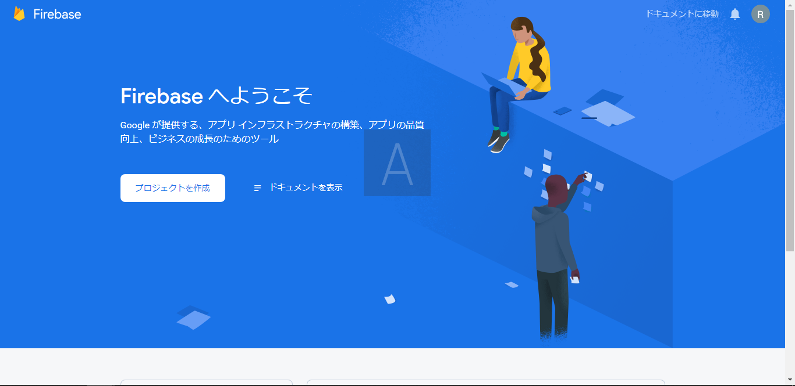
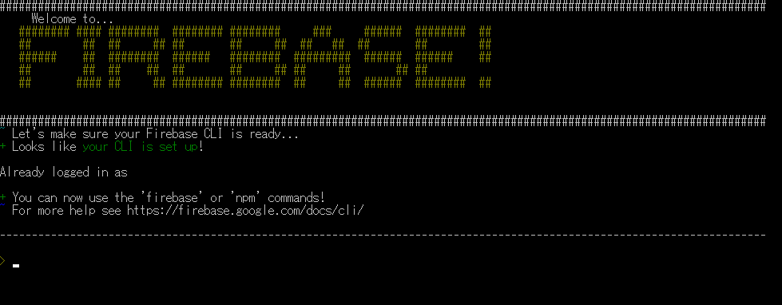

author: ReERishun
summary: Firebaseハンズオン用のセットアップ資料
id: 20201017firebase-handes-on-setup
categories: codelab,markdown
environments: Web
status: Published
feedback link: A link where users can go to provide feedback (Maybe the git repo)
analytics account: Google Analytics ID

# Firebase×JavaScript 1DAY実践ハンズオン【事前準備編】

## Googleアカウントの作成
Duration: 0:05:00

> このページはGoogleのアカウントをお持ちの方は必要ありません。
Firebaseの利用にはGoogleアカウントが必要になります。Googleアカウントとは、GmailやGoogleDriveなどを利用する際に使用しているアカウントの事です。


<button>
[Googleアカウントの作成](https://accounts.google.com/signup)
</button>


アカウントに関しては、アカウント作成フォームの内容にしたがって頂ければ問題ないです。

## Firebaseコンソールへのログイン確認
Duration: 0:03:00

Firebaseにログインしていただきます。


<button>
  [Firebaseを開く](https://firebase.google.com/products?hl=ja)
</button>


Firebaseのページが表示されたら、右上の「ログイン」を押してください。


ログインページに遷移すると、

- アカウント一覧が表示される場合：ログインするアカウントを選択してください
- ログインフォームが表示される場合：使用するGoogleアカウントでログインしてください

ログインが完了すると、また元の画面に戻ると思いますので、続いて「コンソールへ移動」を押してください。


すると、以下の画面が表示されるかと思います。



これで、ログイン確認完了です！
ハンズオン当日はこのコンソールを利用しますので、ログイン出来ている状態にしておいてください。

## Firebase CLIのインストール
Duration: 00:10:00

Firebase CLIをインストールする方法として全OS共通として挙げられる方法は2つあります。

1. スタンドアロンバイナリ
2. npm/Node.js

npmと聞いてピンとくる方、Node.js（npm）が既にPCにインストールされている方は**npmでのインストール**に進んでください。
以上に該当しない、または初心者の方や自信のない方は次の**スタンドアロンバイナリでのインストール**に進んでください。

### スタンドアロンバイナリでのインストール

まずは、それぞれのOSに合わせて下記からバイナリをダウンロードしてください。

<button>
  [Windows用のFirebaseCLIバイナリ](https://firebase.tools/bin/win/instant/latest)
</button>

<button>
  [MacOS用のFirebaseCLIバイナリ](https://firebase.tools/bin/macos/latest)
</button>

<button>
  [Linux用のFirebaseCLIバイナリ](https://firebase.tools/bin/linux/latest)
</button>

ダウンロードできたバイナリを開くと、以下のような画面が表示されるかと思います。

※初回は利用可能になるまでかなり時間がかかります。
※画像の内容と違う表示形式のこともあります。

これでスタンドアロンバイナリでのインストールは完了です。
スタンドアロンバイナリでインストールした方は次のページに進んでください。


### npmでのインストール
Positive
: こちらはスタンドアロンバイナリでのインストールをしていない方向けのnpmでのインストールです。
: スタンドアロンバイナリに比べて複雑なため、
: - npmを利用したことある方
: - npmの環境がPC内に整っている方
: - 自信のある方
: のみがこちらの方法でインストールしてみてください。

Firebase CLIには`Node.js`をインストールすると自動的にインストールされる`npm`（node package manager）が必要になります。
そのため、まずは`Node.js`及び`npm`のインストールを行います。

Negative
: 尚、Firebase CLIを使用するにはNode.js v8.0.0 以降が必要になります。
: インストールされているバージョンが v8.0.0 以前であれば、アップデートを行ってください。
: バージョンに関しては、`node --version` にて確認できます。

インストール方法に関しては以下のQiitaの記事を参考にしてください。

**Windowsの場合**
[Node.jsをインストールする - Qiita](https://qiita.com/sefoo0104/items/0653c935ea4a4db9dc2b)

**Mac OSの場合**
[MacにNode.jsをインストール - Qiita](https://qiita.com/kyosuke5_20/items/c5f68fc9d89b84c0df09)

**Ubuntuの場合**
[Ubuntuに最新のNode.jsを難なくインストールする - Qiita](https://qiita.com/seibe/items/36cef7df85fe2cefa3ea)

※検証環境が無かったため全て未検証です。
上記OS以外を利用されている方、インストールが上手くいかないという方はDiscordにて遠慮なく質問してください！

### Firebase CLIのインストール
そして、先程入れた`npm`を利用して以下のコマンドでインストールします。
```console
npm install -g firebase-tools
```
これでグローバルにFirebase CLIが利用可能になります。


## Firebase CLIへのログイン
Duration: 00:03:00

Firebase CLIのインストールが完了したらログインをします。

```console
$ firebase login
```

このコマンドを実行するとブラウザが開くと思います。
Firebase用に作成したアカウント、もしくはFirebase用に使用予定のアカウントを選択してログインしてください。

問題なく、ログインができれば完了です。

以上で環境構築は終了です！
お疲れ様でした。


## 開発環境に関して（おまけ）
Duration: 00:10:00

### オススメの開発環境紹介
エディタや統合開発環境の個人的なオススメを紹介します。

### VisualStudioCode

恐らく、利用されている方が多いと思うエディタですが、MicrosoftのVisualStudioCodeです。
エディタとしてテキストの編集をするだけでも使いやすいのですが、豊富なプラグインを利用することで様々な言語に特化させたり便利な機能を使うことが可能です。
メモ帳などで開発している方やVSCode以外で開発されてて便利なエディタを探されている方は導入してみてはいかがでしょうか？

<button>
  [VisualStudioをダウンロード](https://code.visualstudio.com/download)
</button>


### JetBrains

JetBrainsはチェコの企業で、多くの統合開発環境を提供している企業です。
Web開発に特化した「WebStorm」、PHPなら「PHPStorm」、PythonならPyCharmなどなど…
分野や言語に応じた統合開発環境を用意しています。

#### 何が良いの？
- 言語や分野に応じた豊富なプラグイン
- プロジェクト全体を網羅した自動補完
- 自動保存機能
- 便利なGit機能
などなど。

#### 学生は無料
一部では高級IDEとも言われていますが、学生は無料で利用できます。
折角の学生のうちですので、まずは一度インストールしてみて合うか合わないか見てみるのも良いかと思います！

詳しくは以下を参考にしてみてください。
[JetBrainsの学割の申請方法について - Qiita](https://qiita.com/tetrapod117/items/92f965cf1928739b70e4)

WebStormのメリットはこちら
[ウェブ制作にはWebStormがお勧め！使いこなせば操作が爆速になる機能のまとめ - ics.media](https://ics.media/entry/11642/)


## 参考
Duration: 00:00:00
